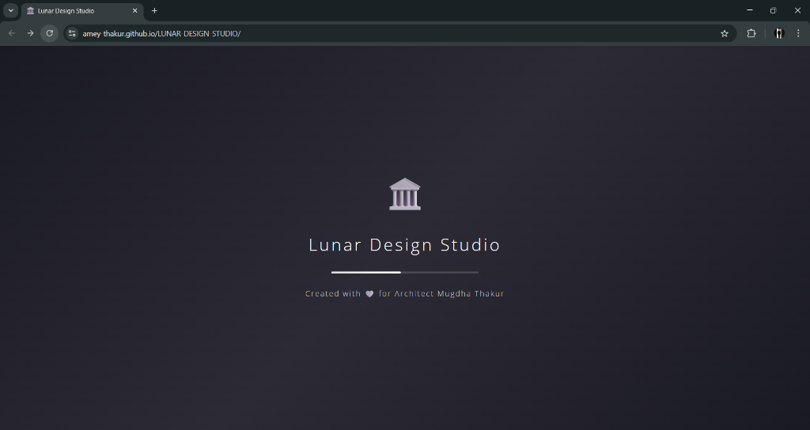
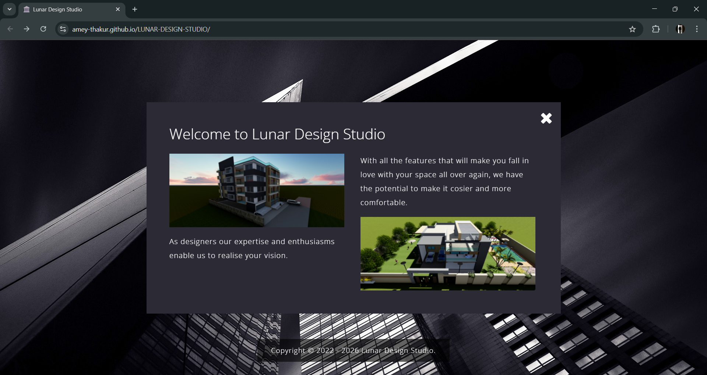
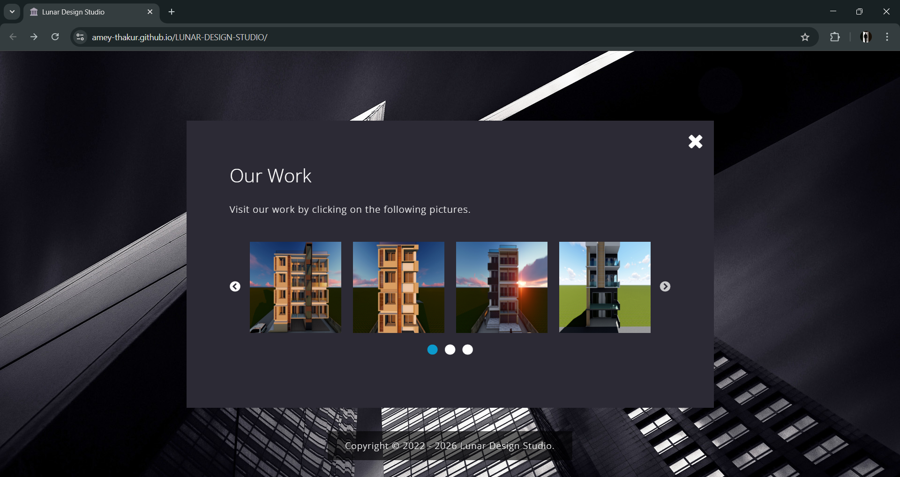
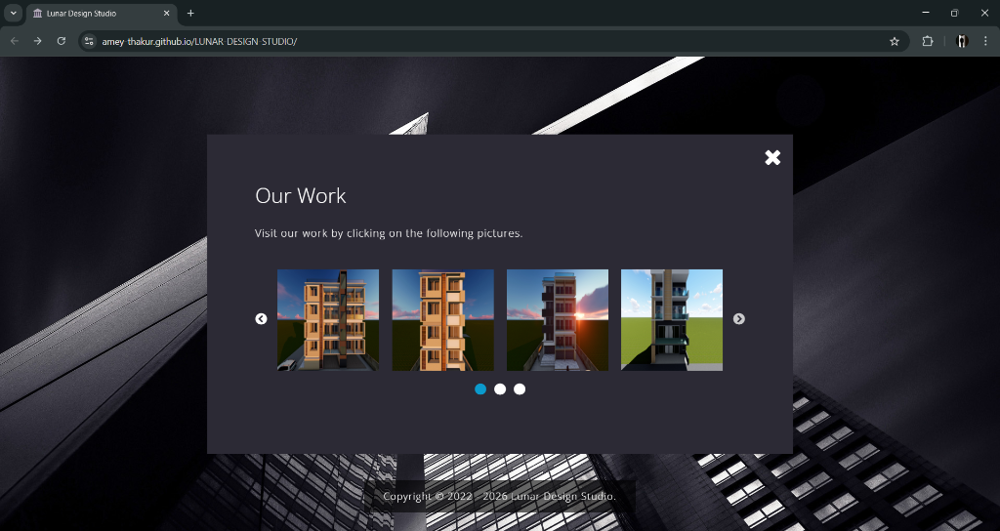
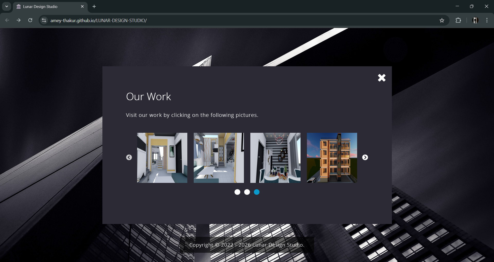
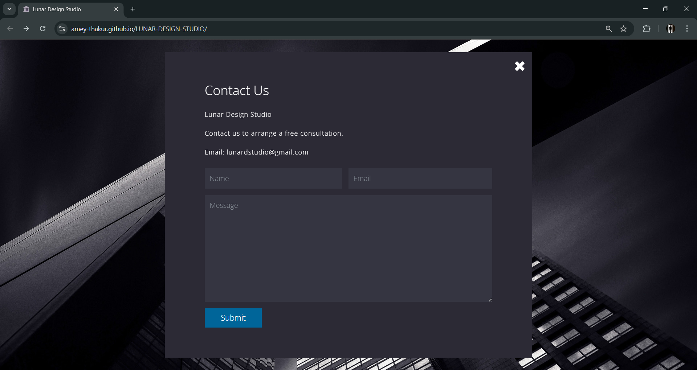

<div align="center">

  <a name="readme-top"></a>
  # Lunar Design Studio

  [](LICENSE)
  
  [](https://github.com/Amey-Thakur/LUNAR-DESIGN-STUDIO)
  [](https://github.com/Amey-Thakur)

  A professional **Architecture Portfolio Project** designed for **Architect Mugdha Thakur**, featuring immersive animations, 3D visualization galleries, and an architectural modernist aesthetic.

  **[Source Code](Source%20Code/)** &nbsp;·&nbsp; **[Technical Specification](docs/SPECIFICATION.md)** &nbsp;·&nbsp; **[Live Demo](https://amey-thakur.github.io/LUNAR-DESIGN-STUDIO/)**

</div>

---

<div align="center">

  [Authors](#authors) &nbsp;·&nbsp; [Overview](#overview) &nbsp;·&nbsp; [Features](#features) &nbsp;·&nbsp; [Structure](#project-structure) &nbsp;·&nbsp; [Results](#results) &nbsp;·&nbsp; [Quick Start](#quick-start) &nbsp;·&nbsp; [Usage Guidelines](#usage-guidelines) &nbsp;·&nbsp; [License](#license) &nbsp;·&nbsp; [About](#about-this-repository) &nbsp;·&nbsp; [Acknowledgments](#acknowledgments)

</div>

---

<!-- AUTHORS -->
<div align="center">

  <a name="authors"></a>
  ## Authors

  | <a href="https://github.com/Amey-Thakur"></a><br>[**Amey Thakur**](https://github.com/Amey-Thakur)<br><br>[](https://orcid.org/0000-0001-5644-1575) |
  | :---: |

</div>

> [!IMPORTANT]
> ### 🤝🏻 Special Acknowledgement
> *Created for **[Architect Mugdha Thakur (Tai)](https://www.instagram.com/_the.confuzedsoul?igsh=NTc4MTIwNjQ2YQ==)**.*
> *Owner of **Lunar Design Studio**.*

---

<!-- OVERVIEW -->
<a name="overview"></a>
## Overview

**Lunar Design Studio** is a high-fidelity portfolio website engineered to showcase architectural and interior design mastery. Built with **HTML5**, **CSS3**, and **JavaScript**, it emphasizes visual storytelling through a responsive, gallery-driven interface. The project serves as a digital storefront for architectural services, bridging the gap between physical space design and digital presentation.

### Core Philosophy
The design is governed by strict **aesthetic principles** ensuring elegance and usability:
*   **Visual Immersion**: The interface utilizes full-width visualization and smooth transitions (`Anime.js`) to keep the focus on the architectural imagery.
*   **Minimalist Functionality**: Navigation is streamlined into a card-based grid system, allowing intuitive access to services and project galleries.
*   **Architectural Identity**: A sophisticated dark-themed palette (`#2c2a35`) coupled with architecture-specific iconography (🏛️) establishes a professional brand presence.

> [!TIP]
> **User Experience Design**
>
> To maximize engagement, the site employs an **Architectural Loading Sequence**. A custom preloader with a floating architectural icon and progress bar manages asset initialization, ensuring a polished, "no-flicker" entry into the visual experience.

---

<!-- FEATURES -->
<a name="features"></a>
## Features

| Feature | Description |
|---------|-------------|
| **Responsive Grid** | Fluid layout using **Bootstrap 4** adaptations for seamless mobile-to-desktop scaling. |
| **Interactive Gallery** | Touch-enabled image carousels powered by **Slick Slider** for project showcases. |
| **Architectural Loader** | Custom **JS-driven animations** ensuring assets are fully primed before display. |
| **Contact Integration** | Styled form interface for client inquiries and consultations. |
| **Semantic SEO** | Optimized document structure for search engine visibility and accessibility. |
| **Deployment** | Automated CI/CD via **GitHub Actions** for robust static hosting. |

> [!NOTE]
> ### Design System
> We have engineered a **Unified Design Language** that harmonizes typography (Open Sans), color theory (Dark Slate & White), and motion (Fade/Slide effects) to reflect the precision of architectural drafting.

### Tech Stack
- **Languages**: HTML5, CSS3, JavaScript (ES6)
- **Logic**: **Vanilla JS** (Animation & Interaction Logic)
- **Imaging**: **High-Fidelity Rendering** (Exterior & Interior Visualization)
- **UI System**: **Slick Slider** (Carousel Logic)
- **Deployment**: GitHub Actions (Jekyll Pipeline)
- **Hosting**: GitHub Pages

---

<!-- STRUCTURE -->
<a name="project-structure"></a>
## Project Structure

```python
LUNAR-DESIGN-STUDIO/
│
├── .github/                         # Deployment & Automation Layer
│   └── workflows/
│       └── pages.yml                # CI/CD Pipeline (GitHub Pages Deploy)
│
├── docs/                            # Technical Documentation
│   └── SPECIFICATION.md             # Architecture & Design Specification
│
├── screenshots/                     # Project Visualization Gallery
│   ├── 01-loading-screen.png        # System Initialization
│   ├── 02-homepage.png              # Hero Landing Page
│   ├── 03-welcome.png               # Brand Introduction
│   ├── 04-our-services.png          # Service Offerings Carousel
│   ├── 05-our-work-1.png            # Project Gallery (View I)
│   ├── 06-our-work-2.png            # Project Gallery (View II)
│   ├── 07-our-work-3.png            # Project Gallery (View III)
│   └── 08-contact.png               # Client Interaction Interface
│
├── Source Code/                     # Primary Application Layer
│   ├── css/                         # Stylesheets (Main & Plugins)
│   ├── fontawesome/                 # Iconography Assets
│   ├── img/                         # Content Imagery & UI Assets
│   ├── js/                          # Logic Scripts & Libraries
│   ├── slick/                       # Carousel Component Resources
│   └── index.html                   # Core Entry Point (Semantic Markup)
│
├── .gitattributes                   # Git configuration
├── .gitignore                       # Repository Filters
├── CITATION.cff                     # Scholarly Citation Metadata
├── codemeta.json                    # Machine-Readable Project Metadata
├── LICENSE                          # MIT License Terms
├── README.md                        # Comprehensive Project Entrance
└── SECURITY.md                      # Security Policy & Protocol
```

---

<!-- RESULTS -->
<a name="results"></a>
## Results

<div align="center">
  <b>System Initialization: Architectural Loader</b>
  <br>
  <i>Custom architectural preloader with progress tracking.</i>
  <br><br>
  
  <br><br><br>

  <b>Landing Interface: Hero View</b>
  <br>
  <i>Immersive background with high-contrast architectural imagery.</i>
  <br><br>
  
  <br><br><br>

  <b>Brand Identity: Welcome Section</b>
  <br>
  <i>Introduction to the design philosophy and studio mission.</i>
  <br><br>
  
  <br><br><br>

  <b>Capabilities: Service Showcase</b>
  <br>
  <i>Interactive carousel displaying core architectural services.</i>
  <br><br>
  
  <br><br><br>

  <b>Portfolio: Project Gallery I</b>
  <br>
  <i>High-fidelity rendering visualization (Exterior).</i>
  <br><br>
  
  <br><br><br>

  <b>Portfolio: Project Gallery II</b>
  <br>
  <i>Interior design and spatial planning showcase.</i>
  <br><br>
  
  <br><br><br>

  <b>Portfolio: Project Gallery III</b>
  <br>
  <i>Vertical elevation and facade details.</i>
  <br><br>
  
  <br><br><br>

  <b>Client Interaction: Contact</b>
  <br>
  <i>Streamlined inquiry interface.</i>
  <br><br>
  
</div>

---

<!-- QUICK START -->
<a name="quick-start"></a>
## Quick Start

### 1. Prerequisites
- **Web Browser**: Modern browser (Chrome, Firefox, Edge) for rendering.
- **Git**: For version control and cloning. [Download Git](https://git-scm.com/downloads)

> [!WARNING]
> **Local Execution**
>
> For local development, ensure that the project directory structure is preserved. Running the project locally requires strictly maintaining the relative path integrity of the `Source Code` directory for the correct loading of style assets and scripts.

### 2. Installation
Clone the repository to your local machine:

```bash
# Clone the repository
git clone https://github.com/Amey-Thakur/LUNAR-DESIGN-STUDIO.git
cd LUNAR-DESIGN-STUDIO
```

### 3. Execution
You can run the application directly by opening the entry file:

**Native Browser Execution**
1. Navigate to the `Source Code` folder.
2. Open `index.html` in your preferred web browser.

---

<!-- =========================================================================================
                                     USAGE SECTION
     ========================================================================================= -->
## Usage Guidelines

This repository is openly shared to support learning and knowledge exchange across the academic community.

**For Students**  
Use this project as reference material for understanding interactive web design, frontend development patterns, and responsive UI principles. The source code is available for study to facilitate self-paced learning and exploration of user-centric design patterns, specifically focusing on grid layouts and carousel implementation.

**For Educators**  
This project may serve as a practical lab example or supplementary teaching resource for Web Development and Design courses. Attribution is appreciated when utilizing content.

**For Researchers**  
The documentation and design approach may provide insights into digital architectural representation and online portfolio structuring.

---

<!-- LICENSE -->
<a name="license"></a>
## License

This repository and all its creative and technical assets are made available under the **MIT License**. See the [LICENSE](LICENSE) file for complete terms.

> [!NOTE]
> **Summary**: You are free to share and adapt this content for any purpose, even commercially, as long as you provide appropriate attribution to the original authors.

Copyright © 2022 Amey Thakur

---

<!-- ABOUT -->
<a name="about-this-repository"></a>
## About This Repository

**Created & Maintained by**: [Amey Thakur](https://github.com/Amey-Thakur)  
**Project Type**: Architecture Portfolio Project  
**Commissioned By**: [Lunar Design Studio](https://github.com/LunarDesignStudio)

This project features **Lunar Design Studio**, an architecture portfolio website created for **Architect Mugdha Thakur**. It represents a professional exploration into **Frontend Development** and immersive web design.

**Connect:** [GitHub](https://github.com/Amey-Thakur) &nbsp;·&nbsp; [LinkedIn](https://www.linkedin.com/in/amey-thakur) &nbsp;·&nbsp; [ORCID](https://orcid.org/0000-0001-5644-1575)

### Acknowledgments

Grateful acknowledgment to **[Architect Mugdha Thakur (Tai)](https://www.instagram.com/_the.confuzedsoul)** (mugdhathakur99@gmail.com / Lunardstudio@gmail.com) for her visionary design concepts and collaboration. This project was crafted to reflect her architectural ethos and professional brand.

---

<div align="center">

  [↑ Back to Top](#readme-top)

  [Authors](#authors) &nbsp;·&nbsp; [Overview](#overview) &nbsp;·&nbsp; [Features](#features) &nbsp;·&nbsp; [Structure](#project-structure) &nbsp;·&nbsp; [Results](#results) &nbsp;·&nbsp; [Quick Start](#quick-start) &nbsp;·&nbsp; [Usage Guidelines](#usage-guidelines) &nbsp;·&nbsp; [License](#license) &nbsp;·&nbsp; [About](#about-this-repository) &nbsp;·&nbsp; [Acknowledgments](#acknowledgments)

  <br>

  🏛️ **[LUNAR-DESIGN-STUDIO](https://amey-thakur.github.io/LUNAR-DESIGN-STUDIO)**

TEMP_LINE
