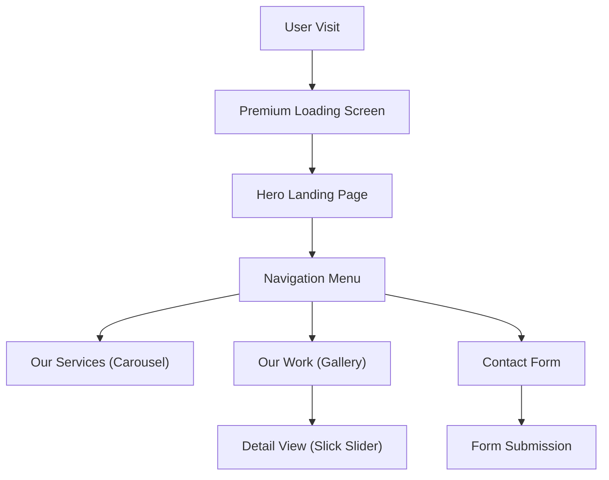

# Technical Specification: Lunar Design Studio

## Architectural Overview

**Lunar Design Studio** is a professional portfolio website designed to showcase architectural and interior design projects. The application serves as a high-fidelity digital presence, emphasizing visual storytelling through immersive animations, responsive layouts, and a clean, modernist aesthetic.

### User Flow Logic

---

## Technical Implementations

### 1. Frontend Architecture
-   **Core**: Built on semantic **HTML5**, **CSS3**, and **JavaScript**, utilizing **Bootstrap 4** for a responsive grid system.
-   **Animation Engine**: Integrates **Anime.js** for fluid transitions and the premium loading screen animations.

### 2. UI/UX Components
-   **Interactive Gallery**: Uses **Slick Slider** to manage the "Our Work" carousel, allowing touch-enabled swiping and responsive navigation.
-   **Loading Sequence**: Custom JavaScript-driven preloader (`index.html`) featuring architecture-themed iconography (🏛️) and a progress bar to ensure asset readiness before display.
-   **Responsive Design**: Mobile-first media queries (`tooplate-style.css`) ensuring visual integrity across devices from mobile to desktop.

### 3. Deployment Pipeline
-   **Hosting**: The project is served via **GitHub Pages** for high-availability static hosting.
-   **CI/CD**: **GitHub Actions** (`pages.yml`) automates the build and deployment process, utilizing the Jekyll build container to sanitize and serve the static assets.

---

## Technical Prerequisites

-   **Runtime**: Modern Web Browser (Chrome, Edge, Firefox, Safari).
-   **Development**: Text Editor (VS Code) and standard web browser for local testing.

---

*Technical Specification | Architecture Portfolio Project | Version 1.0*
